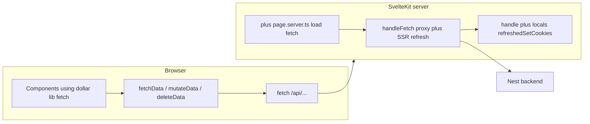

# Authentication transport (SvelteKit frontend)

This document describes how **this repo** wires cookie-based JWT auth to the Nest API: same-origin `/api/*` calls, **browser** refresh, and **SSR** refresh with cookies forwarded to the client.

Backend token design (access vs refresh, env vars) is documented in the API project. Here we only cover the **SvelteKit** side.

## Layout: one browser origin, API under `/api`

- The browser only talks to the **SvelteKit / Vite origin** (e.g. `http://localhost:5173`).
- Requests to `/api/...` are **proxied** to the Nest host (see `vite.config.ts` `server.proxy` in dev; production typically uses NGINX the same way).
- Auth cookies are **first-party** for the app origin, so the browser sends them on `fetch` to `/api/...` without cross-origin CORS for the API.

Build API URLs with [`src/lib/helpers/url.ts`](../src/lib/helpers/url.ts) (`buildApiUrl` → path prefix `/api/...`).

## Two different code paths (important)

| Where it runs | Entry point | Refresh-on-401 |
|---------------|-------------|------------------|
| **Browser** (components, SPA actions) | [`src/lib/fetch/index.ts`](../src/lib/fetch/index.ts) (`fetchData`, `mutateData`, `deleteData`) | Single-flight `POST /api/authentication/refresh`, then **one** retry |
| **Server** (`load` in `+page.server.ts`, etc.) | SvelteKit passes `fetch` into `load`; it goes through [`src/hooks.server.ts`](../src/hooks.server.ts) `handleFetch` | SSR refresh to backend `POST …/authentication/refresh`, merge cookies, retry once; then attach `Set-Cookie` to the **page response** |

**Rule of thumb:** If data only comes from `+page.server.ts`, the initial API calls are **server-side** (no extra refresh logs in this repo—use DevTools **Network** if you need to inspect requests).

## Browser path (`$lib/fetch`)

### Behaviour

- All JSON helpers (`fetchData`, `mutateData`, `deleteData`) wrap requests with **`requestWithSingleFlightRefresh`**.
- On **`401`** for an `/api/*` URL (in the browser only), the wrapper:
  1. Starts or joins a **single** in-flight `POST /api/authentication/refresh` (`refreshPromise`).
  2. On success, **retries the original request once**.
  3. On refresh failure, returns the **original `401` response** (no uncaught throw from the refresh step).

Refresh is **not** attempted for:

- `/api/authentication/login`
- `/api/authentication/refresh`
- `/api/users` (account creation)

Refresh logic is **browser-only** on purpose: a module-level `refreshPromise` must not be shared across concurrent SSR requests.

### Debugging

- Use DevTools **Network** for `/api/*` responses (`401`, retry after refresh, etc.). Optional temporary `console`/`debugger` in [`src/lib/fetch/index.ts`](../src/lib/fetch/index.ts) while investigating.

## SSR path (`hooks.server.ts`)

### `handleFetch`

- Requests whose URL contains `/api/` are rewritten from the public frontend URL to **`VITE_BACKEND_URL`** (server-side).
- The incoming request’s **`Cookie`** header is forwarded so Nest sees the same session as the browser.
- First proxied request uses **`fetch(proxiedRequest.clone())`** so the body stream is not consumed for a later retry.
- On **`401`**, it calls the backend **`POST {VITE_BACKEND_URL}/authentication/refresh`** with the same cookies.
- If refresh returns **`Set-Cookie`**, those lines are:
  - merged into the **`Cookie`** header used for the **retry** of the original API call (`mergeCookieHeader`), and
  - appended to **`event.locals.refreshedSetCookies`** for the browser (see below).

Refresh is skipped for proxied `/api/authentication/refresh`, `/api/authentication/login`, and `/api/users`.

### `handle` + `event.locals.refreshedSetCookies`

`event.cookies.set` cannot safely run inside `handleFetch` after the response is prepared. Instead:

1. At the start of each request, **`handle`** sets `event.locals.refreshedSetCookies = []`.
2. **`handleFetch`** pushes full **`Set-Cookie`** strings onto that array after a successful refresh.
3. After **`await resolve(event, …)`**, **`handle`** merges those lines (**`mergeSetCookieLinesByName`**, last wins per cookie name), **`append`s** them on the outgoing **`Response`**, and returns it.

So the browser’s cookie jar updates from the **HTML / data** response, not only from the internal server-to-backend retry.

### Serialized response headers

[`filterSerializedResponseHeaders`](https://svelte.dev/docs/kit/hooks#Server-hooks-handle) must allow **`set-cookie`** so refreshed cookies reach the client. This repo includes `set-cookie` in that allowlist.

### Debugging

- Inspect failed `/api/*` calls via DevTools **Network** on navigations that hit `load`, or add temporary logging in [`src/hooks.server.ts`](../src/hooks.server.ts) during investigation.

## Mental model diagram

## Production builds and `console`

[`vite.config.ts`](../vite.config.ts) does **not** strip `console` automatically. **Vite 8** defaults to **oxc** minification; there is no simple first-party `drop_console` toggle in config comparable to Terser’s `compress.drop_console` without adding another dependency or plugin.

This repo keeps auth helpers **free of debug logging** so production bundles stay quiet. For ad-hoc debugging, use **`vite dev`**, DevTools **Network**, or temporary logs guarded with `import.meta.env.DEV`.

## Relation to the generic cookie JWT doc

The excerpt you keep for “how access + refresh tokens work” (login, refresh, logout, guards) remains accurate at the API layer. This file is the **wiring map** for **this** frontend: **where** refresh runs and **how** cookies move on SSR and in the browser.
